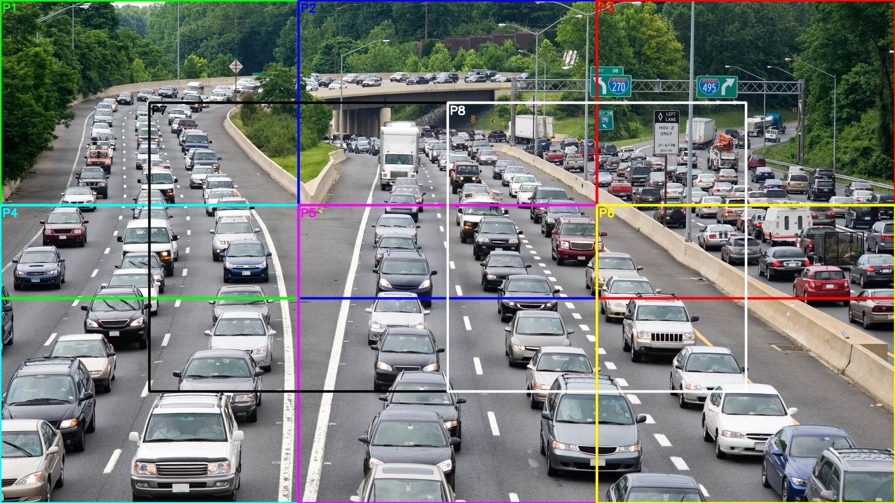

# Compile and Run YOLO MXQ Model for Processing FHD Images

## Compilation

### 0. Environment Setup

To proceed with the compilation, you need to set up the qbcompiler Docker environment with the qubee compiler installed.

You can follow the [SDK compilationtutorial guide](https://github.com/mobilint/mblt-sdk-tutorial/tree/v0.11.0.1/compilation) to set up the environment.

### 1. Prepare the Model

Prepare the ONNX model with the following command:

```bash
pip install ultralytics # install the ultralytics library if not installed
yolo export model=yolov9m.pt format=onnx # export the YOLO model to ONNX format
```

You may change the model name by replacing `yolov9m` with the model name you want to use, such as `yolov8l`, `yolo11x`, etc.

### 2. Prepare the Calibration Data

Before compiling the MXQ model, you need to prepare the calibration data. The calibration data is a set of images that are similar to the input images that the model will encounter during inference.

We sampled 100 images from the COCO dataset as the calibration data and saved them in the `./COCO_Num100` folder.

With the selected images, you can run the following command to prepare the calibration data as numpy arrays:

```bash
python prepare_calib.py
```

This will generate the calibration data in the `./yolov9m_cali` folder. Each numpy array is a tensor of shape (640, 640, 3).

### 3. Compile the MXQ Model

After preparing the calibration data, you can compile the MXQ model with the following command:

```bash
python model_compile.py --inference_scheme multi # for multi-core mode
python model_compile.py --inference_scheme global8 # for global8-core mode
```

This will generate the MXQ model in the `./yolov9m_multi.mxq` folder for multi-core mode, or in the `./yolov9m_global8.mxq` folder for global8 mode.
You can try both to compare their performance.

## Inference

### 0. Environment Setup

To proceed with the inference, you need to set up the environment equipped with Mobilint's NPU.

To set up the environment, you can follow the [SDK runtime tutorial guide](https://github.com/mobilint/mblt-sdk-tutorial/tree/v0.11.0.1/runtime).

### 1. Basic Inference

Before running the SAHI code, you can test the baseline inference performance with the following command:

```bash
python yolo_inference_with_global8.py --model_path ./yolov9m_global8.mxq --image_path ./traffic_jam.jpg --output_path ./output_global8.jpg --nms_conf 0.25 --nms_iou 0.7
```

This will run the inference with the global8 mode and save the result in the `./output_global8.jpg` file.

The NMS parameters are set to 0.25 for the confidence threshold and 0.7 for the IoU threshold.

During the inference, the code loads an image of size 1080x1920, resizes it, and pads it to 640x640 for the model input.

<div align="center">

</div>

### 2. SAHI Inference

You can also run the SAHI inference with the following command:

```bash
python sahi_inference_with_multi.py --model_path ./yolov9m_multi.mxq --image_path ./traffic_jam.jpg --output_path ./output_multi.jpg --nms_conf 0.25 --nms_iou 0.7 --nmm_ios 0.5
```

This will run the inference with the multi-core mode and save the result in the `./output_multi.jpg` file.

The NMS parameters are set to 0.25 for the confidence threshold and 0.7 for the IoU threshold, and NMM (Non-Maximum Merging) with IoS threshold 0.5 is applied to the results.

During the inference, the code loads an image of size 1080x1920 and divides it into 8 patches of size 640x640 for the model input, as shown in the figure below.

<div align="center">

</div>

> Note: The multi-core mode is optimized to process 8 image batches at once. Because we avoid resizing the input image, there are only a few valid ways to divide it into 8 patches. As a result, the patch-splitting logic is hard-coded in the preprocessing stage. If you want to use a different image size, you will need to manually update this part of the code.

Then, the code constructs a batch of 8 images for the model input, and runs the inference with the multi-core mode.

Finally, the code aggregates the results of the 8 patches and saves the result in the `./output_multi.jpg` file.
